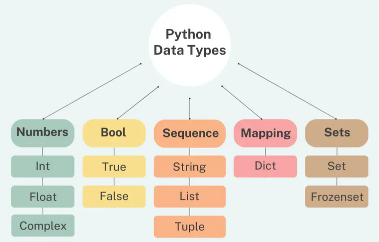

## Python

### Print

```python
print("Hello There")
```

### Input

```python
input("What is your name? ")
```

### Variable

Give a name to a piece of data, like a box with a label.
Notice a str needs "" and an int doesn't.

```python
my_age = 12
my_name = "NatYolo"
```

### Line Break

To add a paragraph break, a new paragraph put in `\n`

```python
print("Hello World\nHello World")
```

<br>

## Data Types

In Python programming, a data type is the classification of data that defines the possible operations that can be done on the object.



### Strings

"Abc" or "123" with double or single quotes.

```python
"Hello"
```

### Integer

Whole numbers without decimal places.

```python
int(123)
123 + 456
```

### Float

Floating point number, decimal number.

```python
float(3.14159)
```

### Boolean

Two values, either True or False.

```python
bool(<value>)
True
False
```

### Subscript

Pulling out an element from the string.

```python
print("Hello"[0])
# Output will be: H, "0" is the index in the string.

```

### Checking Data Types

```python
age = 23
type(age)  # This will print out the type of variable: <class 'int'>
```

### Converting Data Types

```python
float(x)
int(y)
str(a)
```

### Length

Returns the length of an object.

```python
len(x)      # Count the number of items in the list, or characters in strings.
print(len("hello"))     # output: 5 characters
print(len(["apple", "grapes", "orange"]))       # output: 3 items
num_char = len(input("What is your name? \n"))
```

### Type

function returns the type of the object.

```python
a = 123
print(type(a))      # Prints and checks data type - which is an int.

a = str(123)        # Prints and converts data type to a str.
print(type(a))

a = float(123)      # Converts to a float.
print(type(a))
```

### F-Strings

can insert different variable into strings.

```python
score = 0           # string
height = 1.8        # float
is_winning = True   # boolean

# Instead of putting + and converting them..
print("Your score is " + str(score) + ", your height is " + str(height) + " and are you winning? " + str(is_winning))

# Just need to add an 'f' and variable inside {}:
print(f"Your score is {score}, your height is {height} and are you winning? {is_winning}")
```

<br>

## Operators

PEMDAS-LR # Remember PEMDASLR (Parentheses, Exponents, Multiply & Divide, Add & Subtract, Left to Right)

```python
3 + 5
7 - 2
3 * 2
6 / 3       # When you divide, you always end up with a float.
2 ** 2      # To the power of 2. Squared.
()
**
* /
+ -
print(3 * 3 + 3 / 3 - 3)    # This order matters.
```

### Rounding numbers

9 divided by 3, 2 decimals places

```python
(round(9 / 3, 2))
(9 // 2)    # Using // turns this float into an int. no rounding, just remove floats
result = 4 / 2      # 4 / 2 = 2, result is 2.
result /= 2         # getting the result and divide by 2. >> output:1
```

### The `+=` Operator

This is a convenient way of saying: take the previous value and add to it. My age is now 16.

```python
my_age = 12
my_age += 4
```

### Modulo

Modulo operator gives you the remainder result of uneven division

```python
5 % 2  # 2, 2 , 1
# result is 1.

==  # Equal to.
!=  # Not equal to.
>   # Greater than.
<   # Less than.
<=  # Less than or equal to.
>=  # Greater than or equal to.
```

<br>

## Logical Operators

Logical operators are used to combine multiple conditions together and evaluate them as a single boolean expression. There are three types of logical operators in Python: `and`, `or`, and `not`.
<br>

### and

The `and` operator returns `True` if both conditions it is evaluating are true, otherwise it returns `False`.
This expects both conditions either side of the 'and' to be true.

```python
a = 58
if a < 60 and a > 50:
    print("Your grade is C")
```

### or

In Python, the `or` operator is used to combine two or more conditions in a logical expression.
The resulting expression evaluates to True if at least one of the conditions is `True`.

```python
x = 5
y = 10

if x < 3 or y > 9:
    print("At least one condition is true")
else:
    print("Both conditions are false")
```

### not

In Python, the keyword `not` is a logical operator that reverses the boolean value of an expression. It can be used with any expression that evaluates to `True` or `False`. <br>
For example, let’s say we have a boolean variable ‘is_raining’ that is True if it’s currently raining and False otherwise. We can use the ‘not’ operator to check if it’s not raining

```python
is_raining = True
if not is_raining:
    print("It's not raining!")
else:
    print("It's raining.")
```

<br>

## If Statements

This is the basic syntax to test if a condition is true.
If so, the indented code will be executed, if not it will be skipped.

```python
if condition1:
    do x

# In addition to the initial If statement condition, you can add extra conditions to test if the first condition is false. Once an elif condition is true, the rest of the elif conditions are no longer checked and are skipped.

elif condition2:
    do y

# This is a way to specify some code that will be executed if all the above conditions are false:

else:
    do z


condition = True
if condition:
    x = 1
else:
    x = 0
print(x)
```

A shortcut is to put it into one line.

```python
x = 1 if condition is true else 0
```

<br>

### Nested If / Else

```python
if condition:
    if another condition:
        do this
    else:
        do this
else:
    do this
```

<br>

### If / Elif / Else Conditions

you can add extra conditions to test if the initial condition is false.

```python
if condition1:      # condition1 is what we're testing for.
    do A            # < this will be executed if the condition1 is met and skip  all elif and else conditions below.

elif condition2:
    do B
elif condition3:
    do C

else:  # if conditions above aren't met, it will execute this code.
    do this
```

<p>Above are examples of only 1 condition that would be executed.</p>

Below is checking for multiple conditions.

```python
# If none of these conditions is true, then continue without any changes to output.

if condition1:
    print("Do A")
if condition2:
    print("Do B")
if condition3:
    print("Do C")
if condition = false
```

<br>

## Modules

Modular programming refers to the process of breaking a large, unwieldy programming task into separate, smaller, more manageable subtasks or modules. Individual modules can then be cobbled together like building blocks to create a larger application.

```python
import my_module.py         # This will import the module, folder, or file.
print(my_module.pi)     # This will print out that variable from the file.
```

### Random Numbers

```python
import random

random_int = random.randint(0, 101 )    # 100 is now included.
random_float = random.random()
```

<br>

## Lists (Arrays)

<https://docs.python.org/3/tutorial/datastructures.html> <br>
<https://www.codecademy.com/learn/learn-python-3/modules/learn-python3-lists/cheatsheet> <br>
<https://www.codecademy.com/resources/docs/python/lists>

```python
inventory = ["twin bed", "single bed", "headboard", "queen bed", "king bed"]

inventory[0]                        # Specifies the indexed item. Prints 'twin bed'.
inventory[0] = 'single bed'         # Specifies the indexed item listed, then changes its name.
inventory[-1]                       # index can go in reverse, this will print 'kings bed'.
inventory[0][1]                     # Specifies the indexed item within a nested list. This will print T.
inventory.index("twin bed")         # output for this function will be 0 (list.index(element, start, end)

len(inventory)                      # Outputs the length of the list.
inventory[0:3]                      # This is a slice, ['start':'no more than x']
inventory.count("twin bed")         # This is counting how many 'twin bed' strings there are.
inventory.pop(4)                    # Pop can specify which index and store the value in a variable.
inventory.insert(10, "2")  # Adding string into index 11th position.
inventory.append('New state')       # add one item to the END of the list.
inventory[2].append('bed')          # Append within a nested list.
inventory.extend(["New", "new2"])   # adds multiple items to the current list. 

inventory.sort()                    # Sort keeps the original list intact, sorts the list.
sorted(inventory)                   # This is similar, but can create a new variable for the sorted list.

inventory.remove("single bed")      # This will remove 'single bed' from the list.
inventory[1].remove(x)              # removes item in nested list.

inventory.capitalize()              # Capitalizes the first letter of the string.

inventory.range(5)                  # Find the range between 0 (default) and 5.
inventory.range(2, 11, 2)           # Find the range between 2, and before 11, steps in 2.

list(inventory)                     # Converts array into a list.
```

### Nested Lists (2D Lists)

Lists can also be included into already existing lists, called Nested Lists.

```python
fruits = ["Strawberries", "Nectarines", "Apples", "Grapes", "Peaches", "Cherries", "Pears"]
vegetables = ["Spinach", "Kale", "Tomatoes", "Celery", "Potatoes"]
dirty_dozen = [fruits, vegetables]
print(dirty_dozen[1][1][1])    # This will print Kale, its chosing the second list, then the second word of the second list then the second letter.
```

<br>

## Loops


Loops are control flow statements.
Python `for` loops execute a block of code a fixed number of times.
You can iterate over a range, string or sequence etc.
<https://www.programiz.com/python-programming/for-loop>

```python
states_of_america = ["Texas", "Utah", "Florida"]

for states in states_of_america:
    print(states)
    print(states + " of America")


# iterate from i = 0 to i = 3
for i in range(4):
    print(i)

languages = ['Swift', 'Python', 'Go']
# access items of a list using for loop
for i in languages:
    print(i)
```

Python `while` loop is used to run a block code until a certain condition is met
<https://www.programiz.com/python-programming/while-loop>

```python
# program to display numbers from 1 to 5

# initialize the variable
i = 1   # condition, it should be a true statement.
n = 5

# while loop from i = 1 to 5
while i <= n:
    print('i is less than n')

while not i <= n:
    print('i is not less than n')
    # Using a negation of 'not'.

```


## Functions

Functions are a convenient way to divide your code into useful blocks, allowing us to order our code, make it more readable, reuse it and save some time. Different to loops which are used to repeat a block of code, functions are used to perform a specific task.

Functions are a way to group code together. There are built in functions and you can also create your own.
For example, print() and len() are built in functions.

```python
# To create our own function, we use the def keyword. (Notice the indent.)
def my_function():
    print('Hello')
    print('Bye')

my_function()   # Since functins only run when they are called, we need to call it.
```

<!-- 
### Dictionaries

Dictionaries are used to store data values in "key:value" pairs.
A dictionary is a collection which is ordered, changeable and do not allow duplicates.

```python

# List data type and dictionary data type, notice the {} brackets
student_grades_list = [9.1, 8.8, 10.0, 7.7, 6.8, 8.0, 10.0, 8.1, 10.0, 9.9]
student_grades_dict = {"Marry": 8.2, "John": 4.2, "Stacey": 5.9}

thisdict = {"brand": "Ford", "model": "Mustang", "year": 1964}  # "brand", "model, "year" are key paired with values
print(thisdict["brand"])  # output: "Ford"

# do not allow duplicate in dictionary data:
thisdict = {
    "brand": "Ford", 
    "model": "Mustang",
    "year": 1964,
    "year": 2020
}

print(thisdict)         # output: {'brand': 'Ford', 'model': 'Mustang', 'year': 2020}
# there is no year 1964

print(len(thisdict))    # this counts how many keys in the dictionary, which is 3, consisting of "brand", "model, "year" .

# Will add the list together.
mysum = sum(student_grades_list)

length = len(student_grades_dict)
mean = mysum / length
print(mean)

max_grades = max(student_grades_list)
print(max_grades)

print(student_grades_list.count(10.0))  # Counts the amount of times 10 was in the list.

print(random.choice(Name_of_List))  # Can also directly randomly pick from the list.
``` -->
