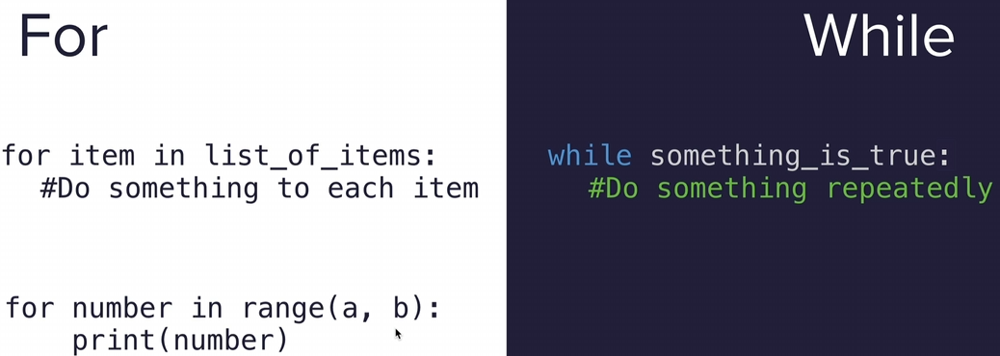

# Python Notes

### Print

```python
print("Hello There")
```

### Input

```python
input("What is your name? ")
```

### Variable

Give a name to a piece of data, like a box with a label.
Notice a str needs "" and an int doesn't.

```python
my_age = 12
my_name = "NatYolo"
```

### Line Break

To add a paragraph break, a new paragraph put in `\n`

```python
print("Hello World\nHello World")
```

<br>

## Data Types

In Python programming, a data type is the classification of data that defines the possible operations that can be done on the object.

### Strings

"Abc" or "123" with double or single quotes.

```python
"Hello"
```

### Integer

Whole numbers without decimal places.

```python
int(123)
123 + 456
```

### Float

Floating point number, decimal number.

```python
float(3.14159)
```

### Boolean

Two values, either True or False.

```python
bool(<value>)
True
False
```

### Subscript

Pulling out an element from the string.

```python
print("Hello"[0])
# Output will be: H, "0" is the index in the string.

```

### Checking Data Types

```python
age = 23
type(age)  # This will print out the type of variable: <class 'int'>
```

### Converting Data Types

```python
float(x)
int(y)
str(a)
```

### Length

Returns the length of an object.

```python
len(x)      # Count the number of items in the list, or characters in strings.
print(len("hello"))     # output: 5 characters
print(len(["apple", "grapes", "orange"]))       # output: 3 items
num_char = len(input("What is your name? \n"))
```

### Type

function returns the type of the object.

```python
a = 123
print(type(a))      # Prints and checks data type - which is an int.

a = str(123)        # Prints and converts data type to a str.
print(type(a))

a = float(123)      # Converts to a float.
print(type(a))
```

### F-Strings

can insert different variable into strings.

```python
score = 0           # string
height = 1.8        # float
is_winning = True   # boolean

# Instead of putting + and converting them..
print("Your score is " + str(score) + ", your height is " + str(height) + " and are you winning? " + str(is_winning))

# Just need to add an 'f' and variable inside {}:
print(f"Your score is {score}, your height is {height} and are you winning? {is_winning}")

# For Floats, you can also specify how many decimal places you want to round to.
print(f{amount:.2f})        # This will round to 2 decimal places.
```

<br>

## Operators

PEMDAS-LR # Remember PEMDASLR (Parentheses, Exponents, Multiply & Divide, Add & Subtract, Left to Right)

```python
3 + 5
7 - 2
3 * 2
6 / 3       # When you divide, you always end up with a float.
2 ** 2      # To the power of 2. Squared.
()
**
* /
+ -
print(3 * 3 + 3 / 3 - 3)    # This order matters.
```

### Rounding numbers

9 divided by 3, 2 decimals places

```python
(round(9 / 3, 2))
(9 // 2)    # Using // turns this float into an int. no rounding, just remove floats
result = 4 / 2      # 4 / 2 = 2, result is 2.
result /= 2         # getting the result and divide by 2. >> output:1
```

### The `+=` Operator

This is a convenient way of saying: take the previous value and add to it. My age is now 16.

```python
my_age = 12
my_age += 4
```

### Modulo

Modulo operator gives you the remainder result of uneven division

```python
5 % 2  # = 2, with remainder 1
# result is 1.

==  # Equal to.
!=  # Not equal to.
>   # Greater than.
<   # Less than.
<=  # Less than or equal to.
>=  # Greater than or equal to.
```

<br>

## Logical Operators

Logical operators are used to combine multiple conditions together and evaluate them as a single boolean expression. There are three types of logical operators in Python: `and`, `or`, and `not`.
<br>

### and

The `and` operator returns `True` if both conditions it is evaluating are true, otherwise it returns `False`.
This expects both conditions either side of the 'and' to be true.

```python
a = 58
if a < 60 and a > 50:
    print("Your grade is C")
```

### or

In Python, the `or` operator is used to combine two or more conditions in a logical expression.
The resulting expression evaluates to True if at least one of the conditions is `True`.

```python
x = 5
y = 10

if x < 3 or y > 9:
    print("At least one condition is true")
else:
    print("Both conditions are false")
```

### not

In Python, the keyword `not` is a logical operator that reverses the boolean value of an expression. It can be used with any expression that evaluates to `True` or `False`. <br>
For example, let’s say we have a boolean variable ‘is_raining’ that is True if it’s currently raining and False otherwise. We can use the ‘not’ operator to check if it’s not raining

```python
is_raining = True
if not is_raining:
    print("It's not raining!")
else:
    print("It's raining.")
```

<br>

## If Statements

This is the basic syntax to test if a condition is true.
If so, the indented code will be executed, if not it will be skipped.

```python
if condition1:
    do x

# In addition to the initial If statement condition, you can add extra conditions to test if the first condition is false. Once an elif condition is true, the rest of the elif conditions are no longer checked and are skipped.

elif condition2:
    do y

# This is a way to specify some code that will be executed if all the above conditions are false:

else:
    do z


condition = True
if condition:
    x = 1
else:
    x = 0
print(x)
```

A shortcut is to put it into one line.

```python
x = 1 if condition is true else 0
```

<br>

### Nested If / Else

```python
if condition:
    if another condition:
        do this
    else:
        do this
else:
    do this
```

<br>

### If / Elif / Else Conditions

you can add extra conditions to test if the initial condition is false.

```python
if condition1:      # condition1 is what we're testing for.
    do A            # < this will be executed if the condition1 is met and skip  all elif and else conditions below.

elif condition2:
    do B
elif condition3:
    do C

else:  # if conditions above aren't met, it will execute this code.
    do this
```

<p>Above are examples of only 1 condition that would be executed.</p>

Below is checking for multiple conditions.

```python
# If none of these conditions is true, then continue without any changes to output.

if condition1:
    print("Do A")
if condition2:
    print("Do B")
if condition3:
    print("Do C")
if condition = false
```

<br>

## Modules

Modular programming refers to the process of breaking a large, unwieldy programming task into separate, smaller, more manageable subtasks or modules. Individual modules can then be cobbled together like building blocks to create a larger application.

```python
import my_module.py         # This will import the module, folder, or file.
print(my_module.pi)     # This will print out that variable from the file.
```

### Random Numbers

```python
import random

random_int = random.randint(0, 101 )    # 100 is now included.
random_float = random.random()
random.choice(list_)    # Picks a random parameter from a list, string or tuple.
```

<br>

## Lists (Arrays)

<https://docs.python.org/3/tutorial/datastructures.html> <br>
<https://www.codecademy.com/learn/learn-python-3/modules/learn-python3-lists/cheatsheet> <br>
<https://www.codecademy.com/resources/docs/python/lists>

```python
inventory = ["twin bed", "single bed", "headboard", "queen bed", "king bed"]

inventory[0]                        # Specifies the indexed item. Prints 'twin bed'.
inventory[0] = 'single bed'         # Specifies the indexed item listed, then changes its name.
inventory[-1]                       # index can go in reverse, this will print 'kings bed'.
inventory[0][1]                     # Specifies the indexed item within a nested list. This will print T.
inventory.index("twin bed")         # output for this function will be 0 (list.index(element, start, end)


inventory[0:3]                      # This is a slice, ['start':'no more than x']

string = "abc123"                   # This will output the string reversed
reversed_string = string[::-1]
print(reversed_string)              

inventory.count("twin bed")         # This is counting how many 'twin bed' strings there are.
inventory.pop(4)                    # Pop can specify which index and store the value in a variable.
inventory.insert(10, "2")           # Adding string into index 11th position.
inventory.append('New state')       # add one item to the END of the list.
inventory[2].append('bed')          # Append within a nested list.
inventory.extend(["New", "new2"])   # adds multiple items to the current list.

inventory.sort()                    # Sort keeps the original list intact, sorts the list.
sorted(inventory)                   # This is similar, but can create a new variable for the sorted list.

inventory.remove("single bed")      # This will remove 'single bed' from the list.
inventory[1].remove(x)              # removes item in nested list.

inventory.capitalize()              # Capitalizes the first letter of the string.

inventory.range(5)                  # Find the range between 0 (default) and 5.
inventory.range(2, 11, 2)           # Find the range between 2, and before 11, steps in 2.

len(inventory)                      # Outputs the length of the list.
list(inventory)                     # Converts array into a list.

new_list = zip(inventory, bedding)  # This is a function that combines multiple lists into one.
```

### Nested Lists (2D Lists)

Lists can also be included into already existing lists, called Nested Lists.

```python
fruits = ["Strawberries", "Nectarines", "Apples", "Grapes", "Peaches", "Cherries", "Pears"]
vegetables = ["Spinach", "Kale", "Tomatoes", "Celery", "Potatoes"]
dirty_dozen = [fruits, vegetables]
print(dirty_dozen[1][1][1])    # This will print Kale, its chosing the second list, then the second word of the second list then the second letter.
```

<br>

## Loops


Two types of loops.<br>
<strong>Indefinite iteration</strong>, where the nmbers of times the loop is executed depends on how many times a condition is met.<br>
<strong>Definite iteration</strong>, where the tnumber of times the loop will be executed is defines in advanced (usually based on the collection size).
<br>

Loops are control flow statements.
Python `for` loops execute a block of code a fixed number of times.
You can iterate over a range, string or sequence etc.
<https://www.programiz.com/python-programming/for-loop>

```python
# for loops follow this pattern.
for <temporary variable> in <collection>:
  <action>

states_of_america = ["Texas", "Utah", "Florida"]
for states in states_of_america:
    print(states)

for states in states_of_america: print(states)

for number in range(5):
    print("This is number " + str(number + 1))
          
languages = ['Swift', 'Python', 'Go']
# access items of a list using for loop
for i in languages:
    print(i)
```

Python `while` loop is used to run a block code until a certain condition is met
<https://www.programiz.com/python-programming/while-loop>

```python
# While loops follow this pattern.
while <conditional statement>:
  <action>

count = 0 
while count <= 3:
    count += 1      # Adds 1 to the count each iteration.
    print(count)

# Multiple lines, notice the ; <--
while count <= 3: print(count); count += 1
```

<br>
You can run the program again by settings a condition to True.
Example below:

```python
machine_on = True
while machine_on:
    print("Machine is running")
    answer = input("Turn off now?")
    
    if answer == "yes":
        machine_on = False
```

<br>

### Loop Breaks

Completely terminates the loop and exits it immediately. Execution continues after the loop.

```python
items_on_sale = ["blue shirt", "striped socks", "knit dress", "red headband", "dinosaur onesie"]

for item in items_on_sale:
  print(item)
  if item == "knit dress":
    break  # Instead of the loop continuing to interate, it breaks at knit dress.

print("End of search!")

while counter < 10:
    counter += 1
    if randint(1,11) == 11:
        print ('Won!')
        break
else:
print ('done')
# Won!
```

### Loop Continues

Continues do not terminate the loop. It skips the current iteration and continues to the next iteration of the loop.

```python
ages = [12, 38, 34, 26, 21, 19, 67, 41, 17]

for int in ages:
  if int < 18:  # if 12 is < 18 (True), skip. Otherwise, print integer.
    continue
  print(int)
```

### Nested Loops

Useful for pulling data from nested lists.

```python
sales_data = [[12, 17, 22], [2, 10, 3], [5, 12, 13]]

scoops_sold = 0

for location in sales_data:
  print(location)
  for scoops in location:
    scoops_sold += scoops
    print(scoops_sold)
print(scoops_sold)

```

<br>

## List Comprehensions

List Comprehensions provide a concise was for creating lists.
Can be used to create new lists from existing lists. Instead of using the `for`, `in` and `else` functions, we can use the `for` and `in` keywords in the list comprehension.

<https://www.codecademy.com/learn/learn-python-3/modules/learn-python3-loops/cheatsheet>

```python
#new_list = [<expression> for <element> in <collection>]
new_list = [new_item for item in list]
new_list = [new_item for item in list if condition]

#Intergers
numbers = [12, 99, 100]
even = [int for int in numbers if int % 2 == 0]

#Strings
fruits = ['apple', 'banana', 'orange', 'pear', 'kiwi', 'apple', 'banana']
edible = [print(fruit) for fruit in fruits ]

#Booleans
bits = [False, True, False, False, True, False]
new_bits = [1 if bits == True else 0 in bits]

# Old method.
for b in bits:
    if b == True:
        new_bits.append(1)
    else:
        new_bits.append(0)


numbers = [2, -1, 79, 33, -45]
only_negative_doubled = []

for num in numbers:
  if num < 0: 
    only_negative_doubled.append(num * 2)


only_negative_doubled = [num * 2 for num in numbers if num < 0]


# Using an `if` `else` statment within list comprehensions.
numbers = [2, -1, 79, 33, -45]
doubled = [num * 2 if num < 0 else num * 3 for num in numbers ]
print(doubled)


#Syntax examples for each.
numbers = [2, -1, 79, 33, -45]

no_if   = [num * 2 for num in numbers]
if_only = [num * 2 for num in numbers if num < 0]
if_else = [num * 2 if num < 0 else num * 3 for num in numbers]

```

<br>

## Functions

<https://www.codecademy.com/learn/learn-python-3/modules/learn-python3-functions/cheatsheet>

Functions are a convenient way to divide your code into useful blocks, allowing us to order our code, make it more readable, reuse it and save some time. Different to loops which are used to repeat a block of code, functions are used to perform a specific task.

Functions are a way to group code together. There are built in functions and you can also create your own.
For example, print() and len() are built in functions.

There are two types of functions: <br>

- Perform a task such as Print()
- Calculate and return a value such as round(), len()


```python
# To create our own function, we use the def keyword. (Notice the indent.)
def my_function():
    print('Hello')
    print('Bye')

my_function()   # Since functins only run when they are called, we need to call it.
```

### Parameters and Arguments

Parameters and arguments are used to pass information to a function.
<br>
```Parameters``` are temporary variables that are used within the function.
```Arguments``` are the actual values that are passed to the function when it is called.

There are three types of argument we can give a function. <br>
Positional arguments, keyword arguments and default arguments.

- Positional arguments are the most common and are passed to a function in the order they are defined.
- Keyword arguments are identified by the parameter name.
- Default arguments are used when the argument is not passed to the function.

<br>

```python
def happy_birthday(name):               # name is the parameter.
    print(f"Happy Birthday {name}")     
happy_birthday("Nat")                   # Nat (name) is the argument.

                                        # Multiple parameters and arguments (positions matter).
def happy_birthday(name, age):          # name and age are the parameters.
    print(f"Happy Birthday {name}, you are {age} years old.")
happy_birthday("Nat", 25)               # Nat and 23 are the arguments.
```

### Return Statement and Multiple Returns

Return statement is used to exit a function and go back to the place where it was called. It can also be used to send back an expression to the caller.

```python
def add_func(x, y):
    z = x + y
    return z

def subtract_func(x, y):
    z = x - y
    return z

print(add_func(1, 2))       # Output: 3, calls the func above.
```

<br>

## Dictionary

Dictionaries are used to store data values in key:value pairs. Dictionaries are written with curly brackets, and they have keys and values. These can be seperated by a colon.

```python
# This is the ideal format for a dictionary.
programming_dictionary = {
    "Bug": "An error in a program that prevents the program from running as expected.",
    "Function": "A piece of code that you can easily call over and over again.",
    "Loop": "The action of doing something over and over again.",
}

# To call the diction, we need to include the key.
print(programming_dictionary["Bug"])

print(capitals.get("USA"))                  # Prints the value of the USA key.
print(capitals.keys())                      # Prints the keys.
print(capitals.values())                    # Prints the values.
print(capitals.items())                     # Prints the items.

# Adding new or modifing items to the dictionary.
programming_dictionary['Loop'] = "This is a modifed definition."
capitals.update({"Germany": "Berlin"})      # Adds a new key/value pair.

# You can create an empty dictionary.
empty_dict = {}

# Additonally, you can wipe an existing dictionary; modifies the dict to an empty string.
programming_dictionary = {}

capitals.pop("China")                       # Removes the key/value China.
capitals.popitem()                          # Removes the last added item.

```

<br>

### Common Dictionary Methods

```python
# Creating a dictionary with string keys and integer values
my_dict = {"apple": 1, "banana": 2, "cherry": 3}

# Accessing a value by its key
print(my_dict["apple"])  # Outputs: 1

# Adding a new entry
my_dict["date"] = 4
print(my_dict)  # Outputs: {'apple': 1, 'banana': 2, 'cherry': 3, 'date': 4}

# Updating an existing entry
my_dict["apple"] = 5
print(my_dict)  # Outputs: {'apple': 5, 'banana': 2, 'cherry': 3, 'date': 4}

# Removing an entry using del
del my_dict["banana"]
print(my_dict)  # Outputs: {'apple': 5, 'cherry': 3, 'date': 4}

# Loop through a dictionary.
for x in programming_dictionary:
    print(x)                            # This will print the keys.
    print(programming_dictionary[x])    # This will print the values.

# Iterating over keys
for key in my_dict:
    print(key)

# Iterating over values
for value in my_dict.values():
    print(value)

# Iterating over keys and values
for key, value in my_dict.items():
    print(f"Key: {key}, Value: {value}")

if "apple" in my_dict:
    print("Apple is in the dictionary")


print(len(my_dict))  # Outputs: 3
```


<br>

### Nested Dictionaries

You can also create a dictionary within a dictionary, or within a list.

```python
# Nesting a List in a Dictionary.
travel_log = {
'France': ['Paris', 'Lille', 'Dijon'],          # Each Key can only have one value, convert to list to overcome this.
'Germany': ['Berlin', 'Hamburg', 'Stuttgart']
}


# Nesting a Dictionary in a Dictionary.
travel_log = {
'France': {"cities_visited": ['Paris', 'Lille', 'Dijon'], "total_visits": 12},
'Germany': {"cities_visited": ['Berlin', 'Hamburg', 'Stuttgart'], "total_visits": 6}
}


# Nesting a Dictionary in a List.
travel_log = [                                  # Notice the brackets for travel log.
{"country": "France", 
 "cities_visited": ['Paris', 'Lille', 'Dijon'], 
 "total_visits": 12
 },

{"country": "Germany", 
 "cities_visited": ['Berlin', 'Hamburg', 'Stuttgart'], 
 "total_visits": 6
 }
]

```